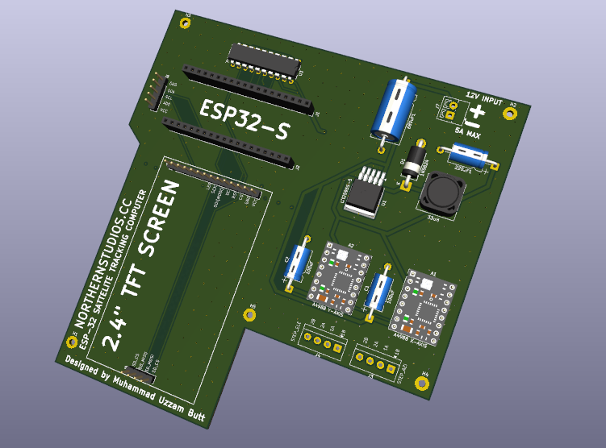

<div align="center">

# ESP32 Satellite Tracker — Orbital Ops v10.0

[](https://opensource.org/licenses/MIT)
[](https://github.com/uzzambutt/ESP32-Sattelite-Tracker/stargazers)
[](https://github.com/uzzambutt/ESP32-Sattelite-Tracker/network/members)
[](https://github.com/uzzambutt/ESP32-Sattelite-Tracker/issues)
[](https://github.com/ellerbrock/open-source-badges/)

**Developer:** [Muhammad Uzzam Butt](https://github.com/uzzambutt) | **Repository:** [ESP32-Sattelite-Tracker](https://github.com/uzzambutt/ESP32-Sattelite-Tracker)


*(Replace PCB_Screenshot_Placeholder.png with your actual PCB screenshot)*

</div>

An ESP32-based automated satellite tracking system that drives a two-axis antenna mount using stepper motors, propagates satellite positions in real time with the SGP4 algorithm, and serves a live web dashboard over WiFi. The system supports a satellite queue, 24-hour pass scheduling, Doppler shift calculation, IMU-assisted elevation correction, weather data, satellite footprint visualization, and full EasyComm II compatibility for use with applications such as Look4Sat.

---

## Table of Contents

1. [Features](#features)
2. [Hardware Requirements](#hardware-requirements)
3. [Wiring Reference](#wiring-reference)
4. [Software Dependencies](#software-dependencies)
5. [File Structure](#file-structure)
6. [Configuration](#configuration)
7. [secrets.h Setup](#secretsh-setup)
8. [Building and Flashing](#building-and-flashing)
9. [First Boot](#first-boot)
10. [Web Dashboard](#web-dashboard)
11. [TFT Screen Reference](#tft-screen-reference)
12. [REST API Reference](#rest-api-reference)
13. [EasyComm II Interface](#easycomm-ii-interface)
14. [Satellite Queue](#satellite-queue)
15. [Pass Schedule](#pass-schedule)
16. [Weather Integration](#weather-integration)
17. [Auto-Park](#auto-park)
18. [OTA Updates](#ota-updates)
19. [Troubleshooting](#troubleshooting)

---

## Features

**Tracking and Propagation**
- Real-time SGP4/SDP4 satellite position propagation via the Sgp4 Arduino library
- Two-axis antenna control (azimuth and elevation) using AccelStepper with smooth acceleration
- Satellite queue: track up to 8 satellites sequentially, with automatic advancement after each pass
- 24-hour pass schedule computed for all queued satellites simultaneously, sorted by AOS time
- Real-time Doppler frequency shift calculation for multi-band (145.8, 435.8, 1268.0 MHz)
- Accurate satellite footprint computation using true orbital altitude and Earth-radius geometry
- Atmospheric drag refraction correction (Bennett 1982) for low-elevation passes

**Displays**
- 240x320 ST7789 TFT with 6 cycling screens:
  - Main HUD: target/current Az/El, pass countdown, Doppler, range, signal bars, radar
  - Pass Schedule: next 24 h passes for all queued satellites
  - IMU Drift Graph: real-time Kalman error history plot
  - Satellite Footprint: geometrically accurate overhead map with nadir, coverage area, arc angle
  - Orbital Elements: Inclination, RAAN, Eccentricity, Period, Perigee/Apogee, Orbit Type, TLE Age
  - Weather: temperature, feels-like, wind speed/direction, humidity, pressure, NOAA Kp Index
- Animated radar with satellite trajectory, AOS/LOS markers, and physics-based footprint ring
- Linux-style boot log with colour-coded status tags on TFT

**Networking and Control**
- WiFi station mode with AP fallback portal for credential setup
- Web dashboard served from PROGMEM over port 80 (ESPAsyncWebServer)
- WebSocket push telemetry at 1 Hz
- EasyComm II protocol over TCP port 4533 for Look4Sat and compatible clients
- mDNS hostname: sattracker.local
- ArduinoOTA firmware updates over WiFi

**Sensors and Intelligence**
- MPU6050 IMU with two-axis Kalman filter
- Accelerometer spike rejection, gyro deadband, and software low-pass filter
- **Note:** The MPU6050 is a 6-axis IMU (Gyro+Accel) and only measures gravity vectors. It can correct wind-drift or step-skipping on the **Elevation** axis, but it cannot determine absolute Azimuth heading without a magnetometer.
- NTP time synchronisation via pool.ntp.org
- Real-time NOAA Space Weather (Geomagnetic Kp index) parsing

**Persistence**
- TLE stored to LittleFS (/tle.txt) and re-loaded on boot
- Observer grid square, operating mode, weather city, and WiFi credentials stored in NVS (Preferences)

---

## Hardware Requirements

| Component | Notes |
|-----------|-------|
| ESP32 development board | 30-pin or 38-pin, dual-core. Tested on ESP32-WROOM-32 |
| ST7789 TFT display | 240x320, SPI interface, 3.3 V logic |
| MPU6050 / GY-521 | I2C IMU, address 0x68 |
| Azimuth stepper driver | Step/Dir interface (e.g. DRV8825, A4988, TB6600) |
| Elevation stepper driver | Step/Dir interface |
| Azimuth stepper motor | NEMA 17 or NEMA 23 depending on load |
| Elevation stepper motor | NEMA 17 or NEMA 23 depending on load |
| Power supply | 12 V or 24 V for stepper drivers; 3.3 V/5 V for ESP32 |

---

## Wiring Reference

### TFT Display (ST7789, SPI)

| TFT Pin | ESP32 Pin | Config Constant |
|---------|-----------|-----------------|
| CS | GPIO 15 | TFT_CS |
| DC | GPIO 2 | TFT_DC |
| RST | GPIO 4 | TFT_RST |
| SCK | GPIO 18 | Hardware SPI (VSPI) |
| MOSI | GPIO 23 | Hardware SPI (VSPI) |
| VCC | 3.3 V | |
| GND | GND | |

### MPU6050 IMU (I2C)

| MPU6050 Pin | ESP32 Pin | Config Constant |
|-------------|-----------|-----------------|
| VCC | 3.3 V | |
| GND | GND | |
| SDA | GPIO 21 | MPU_SDA |
| SCL | GPIO 22 | MPU_SCL |
| AD0 | GND | Sets I2C address to 0x68 |

### Azimuth Stepper Driver

| Signal | ESP32 Pin | Config Constant |
|--------|-----------|-----------------|
| STEP | GPIO 32 | AZ_STEP |
| DIR | GPIO 14 | AZ_DIR |
| ENABLE | GPIO 25 | ENABLE_PIN (shared with elevation) |

### Elevation Stepper Driver

| Signal | ESP32 Pin | Config Constant |
|--------|-----------|-----------------|
| STEP | GPIO 27 | EL_STEP |
| DIR | GPIO 26 | EL_DIR |
| ENABLE | GPIO 25 | ENABLE_PIN (shared with azimuth) |

### Button

| Function | ESP32 Pin | Notes |
|----------|-----------|-------|
| Screen cycle | GPIO 0 | IO0 / BOOT button. Active LOW, internal pull-up enabled |

---

## Software Dependencies

Install all of the following through the Arduino IDE Library Manager or manually:

| Library | Purpose |
|---------|---------|
| Sgp4 | SGP4/SDP4 orbital propagation |
| Adafruit_GFX | TFT graphics primitives |
| Adafruit_ST7789 | ST7789 TFT driver |
| AccelStepper | Stepper motor control with acceleration profiles |
| ESPAsyncWebServer | Asynchronous HTTP and WebSocket server |
| AsyncTCP | Required by ESPAsyncWebServer |
| ArduinoJson | JSON serialisation and deserialisation |
| NTPClient | NTP time synchronisation |
| ArduinoOTA | Over-the-air firmware updates |
| ESPmDNS | mDNS hostname resolution |
| LittleFS (built-in) | Filesystem for TLE storage |
| Preferences (built-in) | NVS key-value persistent storage |
| HTTPClient (built-in) | OpenWeatherMap API requests |
| Wire (built-in) | I2C communication for MPU6050 |

Board package: Install "ESP32 by Espressif Systems" via Boards Manager.
Tested with Arduino IDE 2.x and ESP32 core 2.0.x or 3.x.

---

## File Structure

```
ESP32_Sat_Tracker/
├── ESP32_Sat_Tracker.ino   Main sketch: globals, setup(), loop(), Core0 task,
│                            web server handlers, SGP4 runner, pass prediction,
│                            queue logic, Doppler, footprint, weather fetch
├── Config.h                 Pin definitions, colour palette, tuning parameters
├── secrets.h                WiFi credentials and OWM API key (excluded from VCS)
├── Display_Module.h         All TFT drawing functions (5 screens + radar engine)
├── Runtime_Module.h         EasyComm II parser and SGP4 runtime update function
├── Web_Pages.h              PROGMEM HTML/CSS/JS dashboard and WiFi setup portal
├── qrcodegen.h              QR code generator (used on boot screen)
└── data/                    LittleFS data directory
```

---

## Configuration

All hardware pins, timing constants, and tuning parameters are defined in Config.h. No other file needs editing for a pin reassignment.

### Key Constants

| Constant | Default | Description |
|----------|---------|-------------|
| BTN_PIN | 0 | GPIO for screen-cycle button |
| SCREEN_COUNT | 5 | Number of TFT screens |
| MAX_QUEUED_SATS | 8 | Maximum satellites in the tracking queue |
| MAX_SCHEDULED_PASSES | 48 | Maximum passes in the 24-hour schedule |
| PARK_IDLE_SEC | 300 | Seconds of inactivity before auto-park |
| PARK_AZ | 0.0 | Park azimuth in degrees |
| PARK_EL | 0.0 | Park elevation in degrees |
| WEATHER_INTERVAL_MS | 600000 | Weather fetch interval in milliseconds (10 min) |
| IMU_CORRECT_ENABLED | false | Enable IMU-assisted elevation correction |
| IMU_CORRECT_THRESH | 2.5 | Error threshold in degrees to trigger IMU correction |

### Steps Per Degree

The stepper resolution is set in the main sketch:

```cpp
const float STEPS_PER_DEG = 8.88f;
```

Calculate your value as:

    STEPS_PER_DEG = (motor_full_steps * driver_microsteps * gear_ratio) / 360

Example: 200 steps/rev * 16 microsteps * 1:1 gearbox / 360 = 8.89 steps/degree.

---

## secrets.h Setup

Create this file in the sketch directory. It is excluded from version control.

```cpp
// secrets.h
#pragma once

static const char* ssid     = "YOUR_WIFI_SSID";
static const char* password = "YOUR_WIFI_PASSWORD";

#define OWM_API_KEY "YOUR_OPENWEATHERMAP_API_KEY"
```

Obtain a free API key at https://openweathermap.org/api. The free tier is sufficient; the tracker uses only the Current Weather Data endpoint.

If OWM_API_KEY is not defined, weather fetching is disabled at compile time.

---

## Building and Flashing

1. Open ESP32_Sat_Tracker.ino in Arduino IDE 2.x.
2. Select your ESP32 board under Tools > Board > ESP32 Arduino.
3. Set the partition scheme to "Minimal SPIFFS (1.9MB APP with OTA)" or "Default 4MB with SPIFFS" under Tools > Partition Scheme.
4. Confirm secrets.h exists in the sketch directory.
5. Click Upload.

The first upload must be over USB. Subsequent uploads can use ArduinoOTA.

---

## First Boot

The TFT shows a Linux-style boot log:

```
[  OK  ]  IMU Kalman p=0.00
[  OK  ]  LittleFS mounted
[  OK  ]  Prefs: grid MM71dl
[ WARN ]  No saved TLE
[  ..  ]  Coupling WiFi radio
[  OK  ]  WiFi link up
[  OK  ]  IP 192.168.x.x
[  OK  ]  mDNS sattracker.local
[  OK  ]  NTP sync OK
[  OK  ]  WX Lahore
[  OK  ]  Starting Ops HUD
```

If WiFi fails after 15 seconds, the tracker creates a hotspot named AEROSPACE-TRACKER with password "groundstation". Browse to 192.168.4.1, enter your WiFi credentials, and the device reboots.

---

## Web Dashboard

Browse to http://sattracker.local or the IP address shown on the TFT.

The dashboard polls /api/status every 500 ms and maintains a live WebSocket connection for push updates. The dashboard is served by the ESP32 over port 80 and provides a complete SpaceX/Tesla style UI with animations and glassmorphism. It includes:

1. **Top Bar**: Weather, NOAA Kp index, UTC clock, status badges, and Night Mode toggle.
2. **Telemetry Stat-Strip**: Real-time Azimuth, Elevation, Range, and Doppler shift.
3. **Tactical Radar**: An animated sweeping radar with ghost trails, target lock beam, footprint ring, and crosshairs. Includes manual joystick controls.
4. **World Map Ground Track**: Real-time display of the satellite over an equirectangular world map with its physics-based visibility footprint.
5. **Orbital Database**: Upload raw 3-line TLEs or pull from Celestrak, view the active queue with live visibility dots, and parse raw orbital elements.
6. **24-Hour Pass Schedule**: Displays upcoming passes with maximum elevations and pass quality grades (A/B/C/F). Can be exported to CSV.
7. **QSO Log**: Store manual QSO/contact logs in your browser's local storage with timestamps.

---

## TFT Screen Reference

Press the IO0 button to cycle through screens.

| Screen | Name | Content |
|--------|------|---------|
| 0 | Main HUD | Target and current Az/El, AOS/LOS/countdown, range, Doppler, status indicators, animated radar with trajectory |
| 1 | Pass Schedule | Next passes for all queued satellites, upcoming passes in green, past in grey |
| 2 | IMU Drift Graph | Real-time plot of IMU pitch error vs. time, with correction threshold markers |
| 3 | Satellite Footprint | Overhead ground map: observer at centre, nadir crosshair, footprint ring centred on nadir point. Shows altitude, slant range, footprint radius, arc angle, coverage area in km2, and percentage of Earth surface covered |
| 4 | Weather | City, condition, temperature with feels-like, wind speed and compass direction, humidity, pressure, wind bar, last fetch time |

---

## REST API Reference

All endpoints are on port 80. Bodies are JSON.

### GET /api/status
Full telemetry payload. Called every 500 ms by the dashboard. Also pushed via WebSocket at /ws at 1 Hz.

### POST /api/tle
Upload a new primary TLE. Inserts at queue position 0 and begins tracking immediately.

    { "name": "ISS (ZARYA)", "line1": "1 25544U ...", "line2": "2 25544 ..." }

### POST /api/queue
Append a satellite to the queue without changing the active satellite.

    { "name": "NOAA 18", "line1": "1 28654U ...", "line2": "2 28654 ..." }

Returns {"status":"ok"} or {"status":"full"}.

### POST /api/queue/remove
Remove a satellite by zero-based index.

    { "idx": 2 }

### POST /api/queue/clear
Remove all satellites from the queue.

### GET /api/schedule
Returns the computed 24-hour pass schedule as a JSON array.

    [ { "sat": "ISS (ZARYA)", "aos": 1750000000, "los": 1750000400, "maxEl": 72.3, "aosAz": 315.1 }, ... ]

### POST /api/schedule/refresh
Triggers an immediate recompute. Call before polling /api/schedule.

### GET /api/path
Predicted trajectory of the current satellite for the radar.

    [ { "az": 315.2, "el": 0.0 }, { "az": 316.8, "el": 4.3 }, ... ]

### GET /api/passlog
Last 10 completed passes.

    [ { "sat": "AO-91", "time": "20:14:30", "maxEl": 34.7 }, ... ]

### POST /api/config
Update observer grid square and/or operating mode.

    { "grid": "MM71dl", "obMode": true }

obMode true = internal SGP4. obMode false = external EasyComm mode.

### POST /api/weather/city
Override weather query location by city name. Persists across reboots. Send an empty string to revert to coordinates.

    { "city": "Lahore" }

### POST /api/manual
Manually command Az/El. Only accepted in external mode.

    { "az": 180.0, "el": 45.0 }

### POST /api/wifi
Submit new WiFi credentials (AP portal only). Triggers reboot.

    { "ssid": "MyNetwork", "pass": "password" }

---

## EasyComm II Interface

The tracker listens on TCP port 4533. Compatible with Look4Sat, GPredict, and Ham Radio Deluxe rotator control.

| Command | Action |
|---------|--------|
| AZ\<value\> EL\<value\> | Set target azimuth and elevation in degrees |
| P \<az\> \<el\> | Positional command (alternate format) |
| P or p | Query current position; responds with AZ\<az\> EL\<el\> |

Movement commands are ignored in internal SGP4 mode.

---

## Satellite Queue

The queue holds up to 8 satellites (MAX_QUEUED_SATS). Position 0 is always the actively tracked satellite.

Adding: Upload via /api/tle to insert at position 0, or /api/queue to append.

Automatic advancement: When a pass ends and the satellite drops below the horizon, the tracker removes it from position 0 and begins tracking the next satellite in the queue.

Persistence: Position 0 is written to LittleFS on every TLE upload and reloaded on boot.

---

## Pass Schedule

The schedule scans the next 24 hours for every queued satellite, finds all visible passes, and stores up to 48 results sorted by AOS time. Computation runs in a dedicated FreeRTOS task on Core 0 to keep the display responsive.

Recompute is triggered automatically on boot, every 30 minutes, when the queue changes, and on demand via POST /api/schedule/refresh.

---

## Weather Integration

Weather data is fetched from OpenWeatherMap every 10 minutes (WEATHER_INTERVAL_MS).

Default mode: coordinates derived from the observer Maidenhead grid square.
City override: POST a city name to /api/weather/city. Stored in NVS. If OpenWeatherMap returns 404 for the city name, the firmware automatically clears the override and reverts to lat/lon.

---

## Auto-Park

In internal SGP4 mode, the antenna moves to PARK_AZ / PARK_EL after PARK_IDLE_SEC seconds of no activity and no active pass window. Any antenna movement resets the idle timer. Auto-park is disabled in external EasyComm mode.

---

## OTA Updates

After the initial USB flash, firmware can be updated wirelessly.

Arduino IDE: the device appears as "sattracker" under Tools > Port > Network Ports.

Command line:

    python espota.py -i sattracker.local -f ESP32_Sat_Tracker.ino.bin

No OTA password is set by default.

---

## Troubleshooting

**Display shows garbage or wrong colours**
Verify TFT_CS, TFT_DC, and TFT_RST in Config.h. Confirm the module is 3.3 V logic and VCC is correctly connected.

**IMU shows OFFLINE**
Check SDA/SCL wiring. The calibration requires the board to be stationary for about 1 second on boot.

**WiFi fails and goes to AP mode every boot**
Credentials are saved to NVS after a successful connection. If the router SSID or password has changed, connect to AEROSPACE-TRACKER and re-enter credentials.

**NTP never syncs**
The tracker uses pool.ntp.org over UDP port 123. Ensure the router does not block UDP port 123 outbound. The TFT HUD shows a red dot until sync succeeds; pass predictions and countdowns require sync.

**Stepper moves in the wrong direction**
Swap the DIR wiring on the affected driver, or swap one motor coil pair.

**Schedule shows passes for only one satellite**
Ensure all satellites are in the queue before clicking REFRESH SCHEDULE. If MAX_SCHEDULED_PASSES (48) is exhausted, increase the constant in Config.h and reflash.

**Weather shows the wrong city**
Send POST /api/weather/city with {"city":""} to clear the override and revert to observer coordinates.

**Screen freezes during schedule computation**
Fixed in v10.0: computeSchedule() now runs in a dedicated FreeRTOS task. If freezes persist, reduce MAX_QUEUED_SATS or MAX_SCHEDULED_PASSES in Config.h.

---

## License

This project is open source. See the repository for license details.
